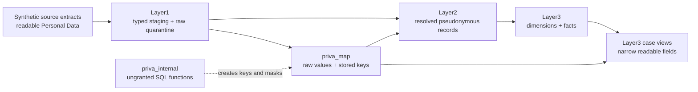

# Architecture and trust boundaries

The central design choice in bricksgdpr is not a particular model name. It is the decision to
make every transition between **readable**, **mapped**, **protected**, and **selectively readable**
data explicit.

## The boundaries do different jobs

**Layer1 preserves evidence.** The staging views type source-shaped rows. The quarantine tables
retain rejected rows and their reasons. This area is readable only by privacy administrators and
the trusted deployment identity.

**`priva_map` separates identity from analytics.** It is the only durable area that deliberately
stores raw values beside their pseudonymous equivalents. Unity Catalog masks change what a direct
reader sees, but the table remains highly sensitive.

**Layer2 removes readable identity from the normal transformation path.** Raw identifiers are
replaced at an ephemeral boundary, then records are resolved or quarantined. The durable Layer2
tables contain pseudonymous keys and non-identifying business values.

**Layer3 presents stable analytical grains.** The dimensions and facts preserve pseudonymous
lineage without copying the mapping table's readable columns.

**Case views are a controlled return path.** They join protected relations to the map using full
pseudonymous tuples and expose only named fields. They do not make `priva_map` generally
available.

**`priva_internal` is not a consumer API.** The hashing, wrapper, and mask functions exist to
materialize and protect governed data. Consumer groups receive no direct execution privilege.

## Conceptually portable, technically specific

The Layer1 → Layer2 → Layer3 organization is a portable way to reason about staging, protected
integration, and analytical outputs. The implementation is not vendor-neutral. It relies on
Databricks and Spark SQL features including Unity Catalog masks and tags, SQL UDF resources,
`secret()`, account-group predicates, `left anti join`, `count_if`, and system information schemas.

That distinction matters. Another warehouse can preserve the architecture, but it cannot run this
project unchanged.

## Why there is no single “secure schema”

Security depends on several boundaries working together:

- relation and parent grants decide which groups can reach each area;
- masks change direct `priva_map` results for restricted readers;
- internal functions are withheld to reduce candidate-value probing;
- case views add an invoker-aware group predicate;
- tests compare the live metadata with intended allowlists.

No one item proves the whole design. In particular, a column mask does not compensate for an
incorrect direct grant, and a correct dbt graph does not prove the live Unity Catalog state.

## Why the date dimension sits beside the lineage

`dim_date` is generated from configured bounds rather than from an upstream seed. Facts derive
integer date keys from their own dates, and relationship tests prove that those keys exist in the
configured calendar. This keeps the calendar reusable, but it also means that dates outside the
configured range fail tests instead of silently expanding the dimension.

For the exact catalog, schema, and relation inventory, see
[Catalogs and schemas](../reference/catalogs-and-schemas.md). For the runnable graph, see
[Layer2 models](../reference/layer2.md) and
[Layer3 models and case views](../reference/layer3-and-case.md).
