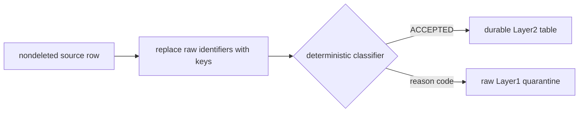

# Quarantine instead of silent dropping

A source row that cannot enter protected analytics still carries operational meaning. Silently
dropping it would hide both a data-quality problem and a possible gap in governed processing.

bricksgdpr therefore divides each nondeleted event, service period, and invoice into exactly one
of two outcomes:

## Why quarantine stays in Layer1

The rejected row may need its readable source values for controlled remediation. Putting it into
Layer2 would violate the promise that durable Layer2 relations contain no raw Personal Data.

Quarantine therefore remains in the restricted raw-data boundary and is readable only by privacy
administrators and the trusted deployment identity.

## One reason wins

A record can violate more than one rule. The classifiers use a fixed order so the same row receives
the same primary reason every time.

For example, an invoice first checks whether its customer and service can be resolved. Only then
does it evaluate service validity, date ranges, and payment consistency. This makes the reason
actionable: an operator fixes the first blocking condition, rebuilds, and then sees whether another
condition remains.

The order is part of the contract. Reordering conditions can change observed reasons even if the
accepted set remains the same.

## Late arrivals can resolve themselves

The quarantine models are rebuilt as tables rather than appended as an error log. A service that
arrives before its customer receives `CUSTOMER_NOT_FOUND`. When the customer later appears, the
same deterministic keys resolve and the next rebuild moves the service into Layer2.

This behavior is different from terminal deletion. Rows associated with a terminally deleted
customer are excluded from both accepted and quarantine outputs; deletion is not presented as a
fixable late-arrival error.

## What the partition tests prove

The singular tests compare the keyed nondeleted inputs with accepted and quarantined outputs. They
assert that no row appears in both and no eligible row disappears from both.

Fixture-specific tests also check exact example counts and reasons. Those counts describe the
synthetic demo; they are not production thresholds.

For the complete reason codes, see [Sources and Layer1](../reference/sources-and-layer1.md) and
[Layer2 models](../reference/layer2.md).
