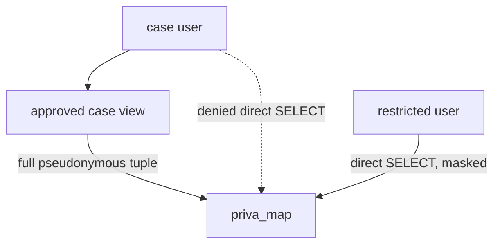

# Stored masks and pseudonymous joins

`priva_map` stores each readable value beside the exact pseudonymous value that represents it. A
Unity Catalog column mask chooses between those two stored columns.

For a masked value, the rule is conceptually:

```sql
case
  when is_account_group_member('privacy_admins')
    or is_account_group_member('case_users')
  then raw_value
  else pseudonymous_value
end
```

## Why the mask returns a stored key

Recomputing a key during every reader query would need access to the pepper and hashing function.
That would expand secret use into the consumer path and make it easier to construct a
candidate-value oracle.

Returning the stored companion key has simpler properties:

- the materialization path is the only place that needs the secret-backed wrapper;
- a restricted reader sees the same value already used by protected models;
- the mask cannot drift because a query used a different canonicalization rule;
- masked queries do not need UDF execution privilege.

## Why joins use key columns directly

Column masks are applied according to the invoker's context. A join on a readable column could
therefore compare different representations for different users.

The project avoids that ambiguity. Layer2 and case views join on stored pseudonymous columns such
as `customer_key`, `service_key`, and `service_version_key`. They never depend on a masked raw
column.

## The mask and grant boundary are coupled

The mask function returns raw values to `case_users` so an authorized case view can resolve fields
in the invoker's context. Safety therefore depends on a separate rule: `case_users` must not have
direct `SELECT` on the mapping tables.



If the direct grant drifts, a case user could read the whole raw map because the mask recognizes
that group as readable. The access tests treat the mask and grant allowlist as one control system
for this reason.

## Why restricted users can query the map

`restricted_users` receive direct map access, but every one of the 13 raw-value columns should
resolve to its stored pseudonymous partner. This makes the mapping relation useful for controlled
key lookup without granting the readable values.

That behavior depends on live Unity Catalog metadata. A successful table build alone does not
prove that every mask is attached; dedicated tests inspect the column-mask catalog.

See [`priva_map` models](../reference/priva-map.md) for the 13 pairs and
[Access control](../reference/access-control.md) for the exact direct-grant matrix.
