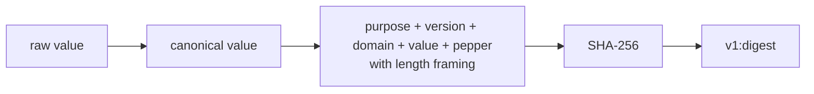

# Versioned, domain-separated keys

The project needs the same source value to become the same analytical key on every build, without
publishing the source value itself. It also needs identical text used for different purposes to
produce different keys.

The result is a key shaped like:

```text
v1:<sha256 digest>
```

## Canonicalization comes first

Stable matching is impossible if equivalent input is formatted differently. Before hashing, the
macros normalize values by kind:

- synthetic SSNs accept nine digits or `XXX-XX-XXXX`, then remove the separators;
- phone numbers require an explicit international `+` prefix and 7–15 digits; permitted display
  separators are removed; letters and ambiguous local numbers fail before hashing;
- dates use ISO `YYYY-MM-DD`;
- other text is trimmed, lowercased, and has repeated whitespace collapsed;
- empty normalized text becomes `null`; empty SSNs/phones fail validation, while explicit nulls remain null.

Composed addresses and full names are assembled in a fixed order before this normalization.

Canonicalization is a data contract. Changing it changes keys, even when the cryptographic
function stays the same.

## A domain gives a value a purpose

The same canonical text is hashed with a stable domain such as `customer.email`,
`customer.full_name`, or `service.installation_address`.

This prevents an equal value from producing an equal key in unrelated contexts. All SSNs that
need to resolve to the same customer intentionally share the `customer.ssn` domain.

## Length framing removes ambiguity

The digest input contains a fixed purpose marker plus the version, domain, canonical value, and
pepper. Each part includes its length. Framing prevents two different sequences of parts from
collapsing into the same concatenated text merely because separators appear inside a value.



## The pepper changes the threat model

The `v1` wrapper reads a secret pepper from the Databricks secret scope and places it directly
inside the hash expression. Someone who can see a protected key but cannot execute the wrapper or
read the secret has a harder time testing candidate source values.

That is why consumer groups receive no UDF execution privilege. A stable pseudonymization function
offered as a general query API would become a matching oracle.

## Versions are migration boundaries

The wrapper compiles only when its project variables remain `v1`, `bricksgdpr`, and `pepper_v1`.
Those names are invariants, not freely supported configuration knobs.

A real rotation should introduce a new version, a new secret name, parallel key columns, and a
consumer migration. Pointing `v1` at a different pepper would make the same label mean a different
identity space and break joins.

!!! important "What the repository does not enforce"
    The code pins the **secret name**, not the secret value. It does not inspect the secret-scope
    ACL and cannot prevent an operator from overwriting `pepper_v1`. Immutability and secret ACLs
    are operational requirements outside the current dbt test suite.

## One stable-identity assumption remains

For active customers, the map keeps the latest row per customer ID and derives the customer key
from its current SSN. Historical SSNs are expanded only for customer IDs with an authorized
deletion plan. If a
nondeleted customer's SSN changes, older-key events and services will not automatically relink to
the new key. A production design needs an alias or identity-history strategy if that change is
possible.

The exact key-function and expression-helper signatures are declared in `functions/_functions.yml`
and `macros/personal_data.sql`.
