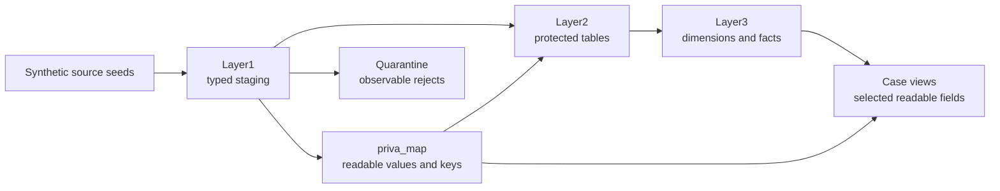

# bricksgdpr

A dbt-first Databricks demonstration of GDPR Personal Data controls. Synthetic source extracts
flow through typed staging, a separately governed raw-to-pseudonymous map, protected analytical
layers, and narrow case views that can resolve selected readable fields.

The **Layer1 → Layer2 → Layer3** organization expresses portable data-platform concepts. This
executable implementation is Databricks-specific: it depends on Unity Catalog grants, tags and
column masks, Databricks SQL functions and secrets, and a Databricks Asset Bundle.

!!! warning "Demonstration, not compliance certification"
    This repository demonstrates selected engineering controls. It is not legal advice, a complete
    GDPR control framework, or proof that a deployment is compliant. Production governance must
    also cover lawful basis, retention, operational approvals, source systems, storage history,
    caches, exports, backups, and incident response.

!!! tip "New here? Start in the browser."
    [Open the browser lab](https://miguelelgallo.github.io/bricksgdpr-publi/tutorial/) and choose
    [the customer flow](https://miguelelgallo.github.io/bricksgdpr-publi/tutorial/?lesson=customer-flow)
    or [invoice quarantine](https://miguelelgallo.github.io/bricksgdpr-publi/tutorial/?lesson=invoice-quarantine).
    These are credential-free DuckDB teaching editions; their deterministic `demo-v1:` keys do not
    reproduce the canonical Databricks pseudonymization or security controls. Continue with
    [Build and explore the demo](tutorials/build-and-explore-the-demo.md) when you are ready to
    exercise the Databricks implementation.

## The governed path

Pseudonymized values remain **Personal Data**. The project never describes them as anonymous, and
no real Personal Data belongs in its synthetic fixtures.

## Find your way around

This documentation follows the [Diátaxis](https://diataxis.fr/) framework. Choose the section that
matches what you need right now.

-   :lucide-graduation-cap: **Tutorial**

    ---

    *Learning-oriented.* Guided lessons that let you build the demo, trace records, and prove its
    key invariants one observable step at a time.

    [:lucide-arrow-right: Tutorial - User Guide](tutorials/index.md)

-   :lucide-wrench: **How-to guides**

    ---

    *Task-oriented.* Focused recipes for environment setup, deployment, scoped builds, identity
    provisioning, access validation, and deletion checks.

    [:lucide-arrow-right: How-to guides](how-to-guides/index.md)

-   :lucide-book-open: **Reference**

    ---

    *Information-oriented.* Exact resource names, grains, settings, commands, security contracts,
    selectors, and project paths.

    [:lucide-arrow-right: Reference](reference/index.md)

-   :lucide-lightbulb: **Explanation**

    ---

    *Understanding-oriented.* The reasons behind the trust boundaries, key design, stored masks,
    quarantine, least privilege, and deletion semantics.

    [:lucide-arrow-right: Explanation](explanation/index.md)

