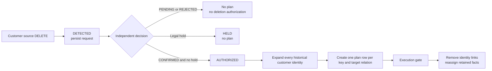

# Customer deletion control

This page is the exact reference contract for customer-driven deletion. A `DELETE` change in the
customer source is the driver, but it is not sufficient by itself to remove downstream data.

## State machine

The ordering is mandatory:

1. `stg_customer` detects a source row whose `source_operation` is `DELETE`.
2. `customer_deletion_requests` stores the request as `DETECTED`. It is incremental and keyed by
   `deletion_request_id`, so ordinary runs do not recreate or silently forget an existing request.
3. `customer_deletion_authorizations` joins a separate privacy decision. `CONFIRMED` authorizes
   work only when `legal_hold` is false. Missing decisions default to `PENDING`.
4. `int_customer_deletion_plan` exists only for `AUTHORIZED` requests. It expands the stable
   `customer_id` to every historical SSN, derives every customer key, and creates a row for every
   governed target.
5. `int_terminal_deleted_customer_keys` reads only complete authorized plans. It admits a key only
   when all 17 targets and their exact actions are present. Existing mapping, Layer2, quarantine,
   Layer3, and case models consume that suppression gate.

There is no direct path from source tombstone to downstream anti-join.

## Control relations

| Relation | Materialization | Grain | Purpose |
| --- | --- | --- | --- |
| `stg_customer_deletion_confirmations` | View | One row per reviewed request | Types the independent decision input |
| `customer_deletion_requests` | Incremental table | One row per source `DELETE` change | Persists detection evidence |
| `customer_deletion_authorizations` | Table | One row per detected request | Applies confirmation and legal-hold gates |
| `int_customer_deletion_plan` | Incremental table | One row per authorized historical customer key and target | Retains exact planned coverage across ordinary runs |
| `int_terminal_deleted_customer_keys` | Incremental table | One row per admitted historical customer key | Durably records suppression admission and feeds deletion/reassignment logic |

The checked-in confirmation seed is a deterministic demo input. A production system should use a
separately authorized case-management or privacy-control source and an append-only audit trail.
A dbt `--full-refresh` can rebuild this demo's incremental ledger, so the ledger is not presented as
a production records-management system.

The authorization gate fails closed. A `CONFIRMED` decision becomes `INVALID`, not `AUTHORIZED`,
when its decision timestamp, reviewer role, reason, or legal-hold value is missing. The shared
target inventory drives plan creation, completeness checking, and the coverage test.

Suppression admission happens before downstream models run. dbt does not provide one atomic
transaction across all 17 targets, so the admission timestamp is not proof that every target
finished successfully. A successful build and post-build tests provide completion evidence for
this demo; production orchestration needs a separate completion/audit event.

## Decision and authorization values

| Input `decision_status` | `legal_hold` | Effective `authorization_status` | Plan created |
| --- | --- | --- | --- |
| Missing or `PENDING` | `false` | `PENDING` | No |
| `REJECTED` | `false` | `REJECTED` | No |
| `CONFIRMED` | `true` | `HELD` | No |
| `CONFIRMED` | `false` | `AUTHORIZED` | Yes |

Incomplete `CONFIRMED` input has effective status `INVALID` and creates no plan.

`CONFIRMED` means the privacy workflow has verified that this exact detected source request may
proceed. The demo does not decide whether Article 17 applies, verify a natural person's identity,
or adjudicate a legal exception; those are controller responsibilities outside dbt.

## Planned target coverage

For every historical customer key, the plan contains these 17 current-state targets:

| Action | Targets |
| --- | --- |
| `DELETE_CURRENT_ROWS` (9 targets) | Three Layer1 quarantine tables, two `priva_map` tables, Layer2 customer/service tables, and Layer3 customer/service dimensions |
| `REASSIGN_TO_ERASED_MEMBER` (4 targets) | Layer2 and Layer3 event/invoice fact tables |
| `EXCLUDE_ERASED_ROWS` (4 targets) | Four controlled case views |

`-99999` is the dedicated erased-subject member for both customer and service relationships. It is
not the generic unknown/missing member and has no readable mapping row.

`assert_customer_deletion_control` fails if any target is missing or unexpected. The fixture
`CUST-0099` has two historical SSNs, so its confirmed request produces 34 plan rows: two keys times
17 targets.

Follow [Customer deletion: before and after](../tutorials/observe-terminal-deletion.md) to build the
real pre-confirmation and post-confirmation states and inspect every Layer3 table.

## Deliberately retained evidence

The source simulator and ordinary staging views retain source changes, including the deletion
tombstone and earlier upserts. Four persisted deletion-control tables retain the minimum request,
decision, plan, and suppression-admission evidence needed to demonstrate the workflow. These are
restricted control records across Layer1 and Layer2, not analytical outputs.

All other persisted Personal Data-bearing demo relations are in the plan. Event and invoice facts
retain their grain under `-99999`, with the original customer and service keys removed. Staging,
source, and fact retention must have a documented purpose and retention period in production; the
demo fixtures are not a justification for indefinite retention.

## Executed behavior versus physical erasure

The dbt build enforces logical current-state unlinking: authorized identity keys disappear from
current outputs and retained facts point to erased members. It does not prove that those facts are
anonymous, nor removal from Delta history, deletion-vector files,
caches, exports, source systems, replicas, object versions, backups, or recipient systems.

For Delta tables with deletion vectors, Databricks documents a separate physical sequence:
`REORG TABLE ... APPLY (PURGE)` rewrites current files, then `VACUUM` removes expired historical
files. Upstream sources and downstream recipients must be handled separately.[^databricks-gdpr]
[^databricks-vacuum]

## GDPR control mapping

| Requirement | Design response | Remaining production obligation |
| --- | --- | --- |
| Article 5 storage limitation and accountability | Durable request state, explicit statuses, target inventory, executable tests | Define retention schedules and retain proportionate evidence |
| Article 12 response timing | Detection and decision timestamps make elapsed time measurable | Enforce the one-month response workflow and extension notices |
| Article 17 erasure and exceptions | Confirmation plus legal-hold gate prevents an unreviewed tombstone from self-authorizing | Verify identity, grounds, scope, and Article 17(3) exceptions |
| Recital 26 and Article 4 identifiability | Original keys and readable mappings are removed; facts use one shared erased member | Prove remaining facts are not reasonably linkable, or continue treating them as Personal Data[^gdpr-recital-26] |
| Article 19 recipient notification | Target list demonstrates internal propagation scope | Maintain recipient/disclosure inventory and notify recipients where required |
| Article 25 protection by design/default | No plan exists before confirmation; one gate controls all downstream models | Periodically test effectiveness and cover systems outside this repo |
| Article 30 processing records | Exact model, state, timestamp, and target fields support traceability | Maintain the controller's full record of processing activities |

The GDPR requires erasure without undue delay when Article 17 applies, while also defining
exceptions such as legal obligations and legal claims. It requires communication of erasure to
recipients under Article 19, accountability under Article 5, and safeguards by design and by
default under Article 25.[^gdpr-5][^gdpr-12][^gdpr-17][^gdpr-19][^gdpr-25][^gdpr-30]

This mapping is engineering guidance, not legal advice or a compliance certification.

Kimball's dimensional guidance recommends special dimension records instead of null fact foreign
keys. That preserves referential integrity, but it does not decide GDPR status: the EDPB states
that pseudonymised data remains Personal Data when it can be attributed using additional
information.[^kimball-nulls][^edpb-pseudonymisation][^gdpr-4] The EDPB's July 2026 version-one
anonymisation guidance uses three practical checks: no record isolation, no linkage, and no
inference. Retaining exact transaction IDs means this demo does not claim to pass that
framework.[^edpb-anonymisation-news][^edpb-anonymisation]

## Implementation paths

- `seeds/customer_deletion_confirmations.csv`
- `models/layer1/stg_customer_deletion_confirmations.sql`
- `models/layer1/customer_deletion_requests.sql`
- `models/layer1/customer_deletion_authorizations.sql`
- `models/layer2/int_customer_deletion_plan.sql`
- `models/layer2/int_terminal_deleted_customer_keys.sql`
- `tests/assert_customer_deletion_control.sql`
- `tests/assert_unconfirmed_deletion_not_authorized.sql`

[^gdpr-5]: [GDPR Article 5 — principles and accountability](https://eur-lex.europa.eu/eli/reg/2016/679/art_5/oj/eng)
[^gdpr-12]: [GDPR Article 12 — action without undue delay and within one month](https://eur-lex.europa.eu/eli/reg/2016/679/art_12/oj/eng)
[^gdpr-17]: [GDPR Article 17 — right to erasure and exceptions](https://eur-lex.europa.eu/eli/reg/2016/679/art_17/oj/eng)
[^gdpr-4]: [GDPR Article 4 — Personal Data and pseudonymisation definitions](https://eur-lex.europa.eu/eli/reg/2016/679/art_4/oj/eng)
[^gdpr-19]: [GDPR Article 19 — notification to recipients](https://eur-lex.europa.eu/eli/reg/2016/679/art_19/oj/eng)
[^gdpr-25]: [GDPR Article 25 — data protection by design and by default](https://eur-lex.europa.eu/eli/reg/2016/679/art_25/oj/eng)
[^gdpr-30]: [GDPR Article 30 — records of processing activities](https://eur-lex.europa.eu/eli/reg/2016/679/art_30/oj/eng)
[^gdpr-recital-26]: [GDPR Recital 26 — identifiability and anonymous information](https://eur-lex.europa.eu/eli/reg/2016/679/oj/eng)
[^databricks-gdpr]: [Databricks — Prepare your data for GDPR compliance](https://docs.databricks.com/aws/en/ldp/gdpr)
[^databricks-vacuum]: [Databricks — Remove unused data files with VACUUM](https://docs.databricks.com/aws/en/delta/vacuum)
[^kimball-nulls]: [Kimball Group — Dealing with null fact foreign keys](https://www.kimballgroup.com/2003/02/design-tip-43-dealing-with-nulls-in-the-dimensional-model/)
[^edpb-pseudonymisation]: [EDPB Guidelines 01/2025 on Pseudonymisation](https://www.edpb.europa.eu/public-consultations/guidelines-012025-on-pseudonymisation_en)
[^edpb-anonymisation-news]: [EDPB announcement — record isolation, linkage, and inference criteria, 8 July 2026](https://www.edpb.europa.eu/news/edpb-sheds-light-on-anonymisation-and-web-scraping-for-generative-ai-and-adopts-final-version_en)
[^edpb-anonymisation]: [EDPB Guidelines 02/2026 on Anonymisation, version 1 under public consultation](https://www.edpb.europa.eu/public-consultations/guidelines-022026-on-anonymisation_en)
