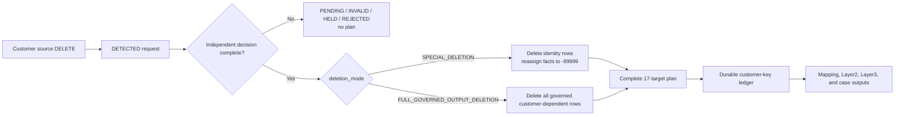

# Customer deletion control

This is the executable contract for a customer-driven deletion. The source `DELETE` detects a
request; an independent, versioned decision chooses what happens next.

| Decision mode | Identity, mapping, service, and quarantine rows | Event and invoice facts | Case views |
| --- | --- | --- | --- |
| `SPECIAL_DELETION` | Delete current rows | Keep the fact grain and replace customer/service keys with `-99999` | Exclude erased rows |
| `FULL_GOVERNED_OUTPUT_DELETION` | Delete current rows | Delete current rows | Exclude deleted rows |

`FULL_GOVERNED_OUTPUT_DELETION` is deliberately narrower than “GDPR erasure.” It means full
deletion from the 17 governed current outputs in this project. It does not claim that source
systems, Delta history, caches, exports, backups, or recipients were erased.

## State machine



The source cannot authorize its own deletion:

1. `customer_deletion_requests` stores every source tombstone as `DETECTED`.
2. `stg_customer_deletion_confirmations` reads a separate append-style decision history.
3. `customer_deletion_authorization_history` evaluates every revision fail closed.
4. `customer_deletion_authorizations` exposes the latest reviewed state for each request.
5. `int_customer_deletion_plan` expands the stable `customer_id` to every historical customer key
   and writes one row per key, decision revision, and governed target.
6. `int_terminal_deleted_customer_keys` admits only plans containing all 17 exact mode-specific
   actions. Customer-dependent models read this ledger through the shared macros.

There is no direct source-tombstone-to-anti-join path.

## Required decision evidence

A `CONFIRMED` revision becomes `AUTHORIZED` only when all of these are true:

- `decision_revision_id` is stable and unique;
- `deletion_mode` is one of the two supported modes;
- `deletion_policy_version` equals the implemented `CUSTOMER_DELETION_V1` policy;
- `recorded_at`, `decided_at`, reviewer role, and reason are present;
- `legal_hold` is explicitly `false`.

Missing evidence or an unsupported mode/policy becomes `INVALID`. A hold becomes `HELD`; a missing
decision remains `PENDING`. None of those states creates plan rows.

`recorded_at` is the immutable revision-ordering field. `decided_at` is retained as business
evidence but is not trusted to order revisions because a review can be backdated.

## Monotonic ledger rules

The terminal ledger has one effective row per historical customer key.

- `FULL_GOVERNED_OUTPUT_DELETION` has precedence over `SPECIAL_DELETION`.
- SPECIAL can escalate to FULL; FULL never downgrades during ordinary incremental runs.
- A newer revision in the same mode advances the effective revision and policy evidence.
- Initial request, revision, mode, policy, and timestamps never change.
- Moving the demo cutoff backward does not remove an admitted key during an ordinary run.

The ledger proves admission to the execution gate, not completion of all downstream relations.
dbt has no single transaction spanning all 17 targets; successful builds and post-build tests are
the completion evidence in this demo.

## Target/action matrix

For every historical customer key, the plan contains exactly 17 target rows.

| Target group | Count | SPECIAL action | FULL action |
| --- | ---: | --- | --- |
| Layer1 quarantines | 3 | `DELETE_CURRENT_ROWS` | `DELETE_CURRENT_ROWS` |
| `priva_map` customer/service mappings | 2 | `DELETE_CURRENT_ROWS` | `DELETE_CURRENT_ROWS` |
| Layer2 customer and service tables | 2 | `DELETE_CURRENT_ROWS` | `DELETE_CURRENT_ROWS` |
| Layer2 event and invoice facts | 2 | `REASSIGN_TO_ERASED_MEMBER` | `DELETE_CURRENT_ROWS` |
| Layer3 customer and service dimensions | 2 | `DELETE_CURRENT_ROWS` | `DELETE_CURRENT_ROWS` |
| Layer3 event and invoice facts | 2 | `REASSIGN_TO_ERASED_MEMBER` | `DELETE_CURRENT_ROWS` |
| Four case views | 4 | `EXCLUDE_ERASED_ROWS` | `EXCLUDE_DELETED_ROWS` |
| **Total** | **17** | **9 delete, 4 reassign, 4 exclude** | **13 delete, 4 exclude** |

## Macro contract

Developers use one generator call. The model type derives the policy; developers do not select
FULL/SPECIAL action strings themselves.

```jinja
{{ generate_customer_deletion_model(
    model_name='int_customer_event_resolution',
    model_type='FACT',
    source_relation=ref('int_customer_events_keyed'),
    primary_key='event_id',
    output_columns=[
        'event_id', 'customer_key', 'event_type', 'occurred_at',
        'measure_value', 'measure_unit', 'source_updated_at'
    ],
    customer_key_column='customer_key',
    special_replacement_columns=['customer_key'],
    erased_flag_column='is_erased_customer'
) }}
```

`FACT` generates SPECIAL replacement and FULL removal. Dimension, mapping, service, quarantine,
identity, and dependent types generate removal for both modes. `CASE_VIEW` generates erased-row
exclusion. The generator validates the primary key, explicit projection, replacement keys, erased
flag, model type, and allowed option combinations.

For a downstream Layer3 fact whose Layer2 source already contains erased keys and the erased flag,
`source_is_policy_applied=true` generates a validating projection instead of attempting to join the
original-key ledger through `-99999`. It still anti-joins the ledger on any surviving original
customer key, so a leaked FULL row cannot pass merely by carrying a false erased flag.

The lower-level `attach_customer_deletion_mode()` and `apply_customer_deletion_policy()` macros are
the runtime engine used by the generator. They remain available for advanced models that must
classify business rules between mode attachment and final policy application.

Run `generate_customer_deletion_scaffold` through `dbt run-operation` to print the complete model
call, declarative target registration, derived action row, schema documentation, and tests. See
[Generate a customer-deletion model](../how-to-guides/generate-customer-deletion-model.md).

dbt recommends macros for reusable SQL and documents their arguments; it also cautions that
readability matters. This split keeps the reusable policy small while each model explicitly lists
its relation, key expression, output columns, and replacement behavior.[^dbt-macros][^dbt-args]

## Why `-99999` is used only for SPECIAL

Kimball recommends descriptive special dimension members instead of null fact foreign keys. The
dedicated `-99999` customer/service members preserve referential integrity and are distinct from an
unknown or not-yet-arrived member.[^kimball-nulls]

That is dimensional modeling guidance, not an anonymisation conclusion. The source transaction ID
and remaining fact attributes can still permit linkage, so the retained SPECIAL facts remain
Personal Data in this project.

## GDPR engineering mapping

| GDPR concern | Implemented control | Production responsibility |
| --- | --- | --- |
| Accountability and storage limitation | Durable detection, immutable decisions, versioned plan, executable coverage tests | Define and enforce retention schedules |
| Article 17 scope and exceptions | Independent confirmation plus explicit legal-hold gate | Verify identity, legal grounds, and Article 17(3) exceptions |
| Article 19 recipients | Exact internal target inventory | Track and notify external recipients where required |
| Protection by design/default | No plan before authorization; unsupported policies fail closed | Periodically test effectiveness and cover systems outside this repo |
| Identifiability | Original modeled keys/mappings removed; SPECIAL facts marked and access-limited | Treat retained facts as Personal Data unless anonymisation is separately demonstrated |

The GDPR requires erasure without undue delay when Article 17 applies and defines exceptions. It
also requires accountability, appropriate retention, and communication to recipients.[^gdpr-5]
[^gdpr-17][^gdpr-19] This page is engineering guidance, not legal advice or certification.

## Current-state versus physical deletion

The build reconstructs current governed relations. It does not prove deletion from Delta table
history or files, upstream replay, caches, exports, object versions, backups, disaster-recovery
copies, or recipient systems. Those require separate retention and purge controls. Read
[Terminal deletion versus physical erasure](../explanation/terminal-deletion-vs-erasure.md).

## Implementation paths

- `macros/customer_deletion_policy.sql`
- `macros/customer_deletion_policy.yml`
- `macros/customer_deletion_generators.sql`
- `macros/customer_deletion_generators.yml`
- `macros/deletion_control.sql`
- `models/layer1/customer_deletion_authorization_history.sql`
- `models/layer1/customer_deletion_authorizations.sql`
- `models/layer2/int_customer_deletion_plan.sql`
- `models/layer2/int_terminal_deleted_customer_keys.sql`
- `tests/assert_customer_deletion_control.sql`

Follow [Customer deletion: before and after](../tutorials/observe-terminal-deletion.md) for the
complete Layer3 table snapshots and [Verify customer deletion](../how-to-guides/verify-terminal-deletion.md)
for the operator checklist.

[^gdpr-5]: [GDPR Article 5 — principles, storage limitation, and accountability](https://eur-lex.europa.eu/eli/reg/2016/679/art_5/oj/eng)
[^gdpr-17]: [GDPR Article 17 — right to erasure and exceptions](https://eur-lex.europa.eu/eli/reg/2016/679/art_17/oj/eng)
[^gdpr-19]: [GDPR Article 19 — notification to recipients](https://eur-lex.europa.eu/eli/reg/2016/679/art_19/oj/eng)
[^kimball-nulls]: [Kimball Group — Dealing with null fact foreign keys](https://www.kimballgroup.com/2003/02/design-tip-43-dealing-with-nulls-in-the-dimensional-model/)
[^dbt-macros]: [dbt Developer Hub — Jinja and macros](https://docs.getdbt.com/docs/build/jinja-macros)
[^dbt-args]: [dbt Developer Hub — macro argument documentation](https://docs.getdbt.com/reference/resource-properties/arguments)
