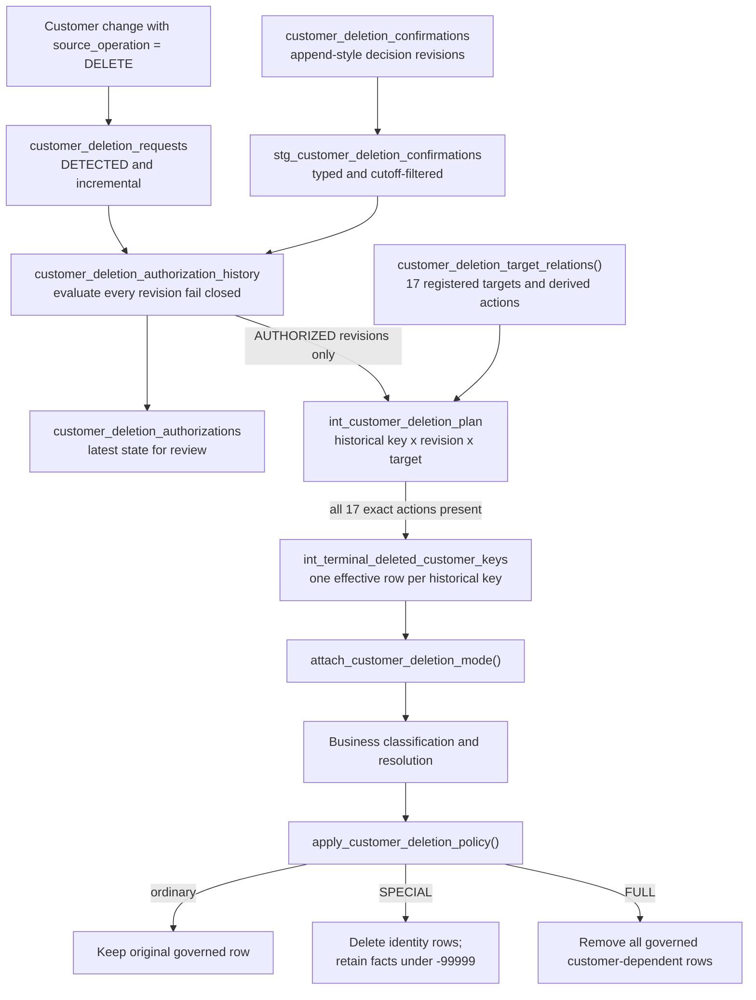
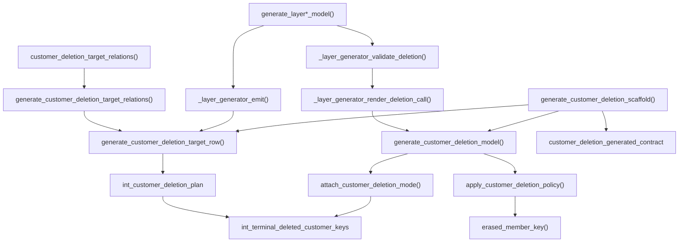

# Customer deletion tombstone and macros

This page is the complete implementation reference for the customer-deletion tombstone. It traces
the state from a source `DELETE`, through independent authorization and target planning, into the
terminal customer-key ledger consumed by governed models. It also inventories every macro that
builds, registers, applies, or tests that state.

The tombstone controls **current governed dbt outputs**. It is not proof of physical erasure from
source systems, Delta history, caches, exports, object versions, backups, disaster-recovery copies,
or recipient systems.

## The word “tombstone” has two meanings here

There are two durable checkpoints, and they must not be treated as equivalent:

| Checkpoint | Relation | Grain | What it proves |
| --- | --- | --- | --- |
| Source tombstone | `customer_deletion_requests` | One row per source `DELETE` change | A potential deletion request was detected and retained for review |
| Effective terminal tombstone | `int_terminal_deleted_customer_keys` | One row per admitted historical pseudonymous customer key | An independent revision authorized a supported mode and its plan covered every registered target |

Only the terminal customer-key ledger is joined by downstream deletion macros. A source tombstone
alone does not remove or rewrite any customer-dependent output.

!!! important "There is no source-delete shortcut"
    `customer_deletion_requests` never feeds a direct anti-join into mappings, facts, or dimensions.
    The request must pass the independent decision history, the fail-closed authorization rules, and
    the complete target-plan gate before its historical customer keys enter the terminal ledger.

## End-to-end state flow



The latest-state `customer_deletion_authorizations` model is an operator-facing view of each
request. The plan intentionally reads every `AUTHORIZED` revision from
`customer_deletion_authorization_history`, not merely the latest-state view. Once a revision has
created a terminal plan, a later pending, rejected, invalid, or held revision cannot silently revoke
that admitted state during an ordinary incremental run.

## Stored relations and grains

| Relation | Materialization | Grain and retention behavior | Role |
| --- | --- | --- | --- |
| `stg_customer` | View | One typed source change | Preserves UPSERT and DELETE changes used by detection and historical-key expansion |
| `customer_deletion_requests` | Incremental merge | One row per `deletion_request_id` | Captures source tombstones as `DETECTED`; ordinary runs do not replace the original detection timestamp |
| `stg_customer_deletion_confirmations` | View | One typed decision revision | Normalizes decision fields and applies `deletion_decision_as_of` to make revision visibility reproducible |
| `customer_deletion_authorization_history` | Table | One row per decision revision that matches a detected request | Evaluates every supplied revision as `AUTHORIZED`, `HELD`, `INVALID`, `REJECTED`, or `PENDING`; requests without a revision do not appear here |
| `customer_deletion_authorizations` | Table | One latest revision per detected request | Presents current review state; a request without a revision is `PENDING` |
| `int_customer_deletion_plan` | Incremental merge | One authorized revision x historical customer key x registered target | Retains target-specific actions and evidence across ordinary runs |
| `int_terminal_deleted_customer_keys` | Incremental merge | One effective row per historical customer key | Serves as the terminal suppression and reassignment gate consumed downstream |

The request and decision-control relations intentionally retain restricted Personal Data and audit
evidence. Terminal deletion removes current governed identity links; it does not delete the evidence
needed to explain why the gate was entered.

## Detection and independent authorization

`customer_deletion_requests` selects `stg_customer` rows whose `source_operation` is `DELETE`. It
stores the change identifier as `deletion_request_id`, the stable `customer_id`, the SSN present on
the delete event, the source timestamp, the first processing timestamp, and constant status
`DETECTED`.

An existing `deletion_request_id` is not inserted again. The model sets `full_refresh: false`,
and its post-hook archives rows outside the model graph. Missing archived control keys block a
subsequent build. See [Deletion operations and recovery](deletion-operations.md).

A decision revision becomes `AUTHORIZED` only when all of the following are true:

- its `decision_status` is `CONFIRMED`;
- `deletion_mode` is `SPECIAL_DELETION` or `FULL_GOVERNED_OUTPUT_DELETION`;
- `deletion_policy_version` equals the configured implemented policy;
- `recorded_at`, `decided_at`, `decided_by_role`, and `decision_reason` are present;
- `legal_hold` is explicitly `false`.

Authorization fails closed:

| Input condition | `authorization_status` | Can create plan rows? |
| --- | --- | --- |
| `legal_hold is null` | `INVALID` | No |
| `legal_hold = true` | `HELD` | No |
| Complete supported confirmation | `AUTHORIZED` | Yes |
| `CONFIRMED` but evidence, mode, or policy is unsupported | `INVALID` | No |
| `decision_status = REJECTED` | `REJECTED` | No |
| Any other incomplete state | `PENDING` | No |

`recorded_at` orders revisions because it represents immutable ingestion order. `decided_at` remains
business evidence but is not used to choose the latest revision; review evidence can be entered
later with an earlier business decision timestamp.

## Historical identity expansion and target planning

An authorized revision carries the stable `customer_id`. The plan joins that ID back to every
historical `stg_customer` row with a nonnull SSN, canonicalizes and pseudonymizes each SSN in the
`customer.ssn` domain, and deduplicates the resulting customer keys. This prevents an older identity
version from surviving merely because the delete event contained only the latest SSN.

Every `(decision_revision_id, customer_key)` is crossed with the fixed target registry. The registry
derives actions from `model_type`; callers do not provide raw action strings.

The exact registry is:

| Layer | Target relation | Model type | Kind | SPECIAL action | FULL action |
| --- | --- | --- | --- | --- | --- |
| `layer1` | `quarantine_customer_events` | `QUARANTINE` | `TABLE` | `DELETE_CURRENT_ROWS` | `DELETE_CURRENT_ROWS` |
| `layer1` | `quarantine_customer_services` | `QUARANTINE` | `TABLE` | `DELETE_CURRENT_ROWS` | `DELETE_CURRENT_ROWS` |
| `layer1` | `quarantine_invoices` | `QUARANTINE` | `TABLE` | `DELETE_CURRENT_ROWS` | `DELETE_CURRENT_ROWS` |
| `priva_map` | `fa_pd_customer` | `MAPPING` | `TABLE` | `DELETE_CURRENT_ROWS` | `DELETE_CURRENT_ROWS` |
| `priva_map` | `fa_pd_service_address` | `MAPPING` | `TABLE` | `DELETE_CURRENT_ROWS` | `DELETE_CURRENT_ROWS` |
| `layer2` | `int_customer_protected` | `IDENTITY` | `TABLE` | `DELETE_CURRENT_ROWS` | `DELETE_CURRENT_ROWS` |
| `layer2` | `int_customer_events_resolved` | `FACT` | `TABLE` | `REASSIGN_TO_ERASED_MEMBER` | `DELETE_CURRENT_ROWS` |
| `layer2` | `int_customer_services_resolved` | `SERVICE` | `TABLE` | `DELETE_CURRENT_ROWS` | `DELETE_CURRENT_ROWS` |
| `layer2` | `int_invoices_resolved` | `FACT` | `TABLE` | `REASSIGN_TO_ERASED_MEMBER` | `DELETE_CURRENT_ROWS` |
| `layer3` | `dim_customer` | `DIMENSION` | `TABLE` | `DELETE_CURRENT_ROWS` | `DELETE_CURRENT_ROWS` |
| `layer3` | `dim_service` | `DIMENSION` | `TABLE` | `DELETE_CURRENT_ROWS` | `DELETE_CURRENT_ROWS` |
| `layer3` | `fct_customer_event` | `FACT` | `TABLE` | `REASSIGN_TO_ERASED_MEMBER` | `DELETE_CURRENT_ROWS` |
| `layer3` | `fct_invoice` | `FACT` | `TABLE` | `REASSIGN_TO_ERASED_MEMBER` | `DELETE_CURRENT_ROWS` |
| `layer3_case` | `case_dim_customer` | `CASE_VIEW` | `VIEW` | `EXCLUDE_ERASED_ROWS` | `EXCLUDE_DELETED_ROWS` |
| `layer3_case` | `case_dim_service` | `CASE_VIEW` | `VIEW` | `EXCLUDE_ERASED_ROWS` | `EXCLUDE_DELETED_ROWS` |
| `layer3_case` | `case_fct_customer_event` | `CASE_VIEW` | `VIEW` | `EXCLUDE_ERASED_ROWS` | `EXCLUDE_DELETED_ROWS` |
| `layer3_case` | `case_fct_invoice` | `CASE_VIEW` | `VIEW` | `EXCLUDE_ERASED_ROWS` | `EXCLUDE_DELETED_ROWS` |

The total is 17 targets. SPECIAL deletes nine table targets, reassigns four fact targets, and
excludes erased rows from four case views. FULL deletes all 13 table targets and excludes deleted
rows from the four case views.

The plan's incremental unique key includes decision revision, customer key, target, mode, and policy
version. A later run can therefore add a new authorized revision or newly registered target without
overwriting the evidence from an earlier revision.

## Terminal-ledger admission algorithm

`int_terminal_deleted_customer_keys` admits a candidate only after these checks:

1. Generate the current required-target relation from `customer_deletion_target_relations()`.
2. Inner-join plan rows to the exact required tuple of layer, relation, kind, and mode-derived action.
3. Keep only `plan_status = 'AUTHORIZED'` and the two implemented deletion modes.
4. Count distinct matching target/action tuples per revision and customer key.
5. Require that count to equal the current registry count. An incomplete plan creates no candidate.
6. Preserve the oldest complete plan as the initial evidence.
7. Select the effective plan by mode precedence, then newest `authorization_recorded_at`, then
   `decision_revision_id`.
8. Merge only a new key, a SPECIAL-to-FULL escalation, or newer evidence for the same mode.

The ledger columns separate initial and effective evidence:

| Column group | Meaning |
| --- | --- |
| `customer_key` | Stable pseudonymous historical identity and incremental unique key |
| Effective revision, request, mode, policy, and timestamps | The currently enforced decision; FULL always outranks SPECIAL |
| `initial_*` fields | The first complete authorized plan that admitted the key; never replaced by an ordinary run |
| `suppression_recorded_at` | First ordinary-run timestamp when the key entered the terminal ledger |
| `mode_escalated_at` | First observed SPECIAL-to-FULL escalation; null when no escalation occurred |

### Monotonic behavior

- SPECIAL can escalate to FULL.
- FULL cannot downgrade to SPECIAL during an ordinary incremental run.
- A newer authorized revision in the same mode advances effective evidence.
- Initial evidence and first suppression time remain unchanged.
- Moving `deletion_decision_as_of` backward cannot remove an already admitted key during an
  ordinary incremental run.
- A later source UPSERT carrying the same historical identity still matches the terminal ledger and
  cannot restore the governed link.

The ledger proves **admission to the execution gate**, not completion of every downstream target.
dbt does not provide one transaction spanning the 17 relations. The build result plus post-build
tests are the completion evidence.

## Runtime behavior after ledger admission

The standard runtime is deliberately split in two so business classification can occur between key
matching and final policy application.

### `attach_customer_deletion_mode()`

This macro left-joins a customer-keyed source to the terminal ledger and appends
`deletion_mode`. It preserves the original keys and every explicitly declared output column.

```jinja
attach_customer_deletion_mode(
    source_relation,
    customer_key_expression,
    output_columns,
    deletion_relation=none,
    source_alias='source_rows'
)
```

| Argument | Required/default | Contract |
| --- | --- | --- |
| `source_relation` | Required | Relation or parenthesized SQL supplying the source rows |
| `customer_key_expression` | Required | Nonempty SQL expression that resolves the source key; qualify it with `source_alias` when needed |
| `output_columns` | Required | Nonempty ordered list of unique, simple identifiers to preserve |
| `deletion_relation` | `none` | One-row-per-key terminal ledger; `none` resolves to `ref('int_terminal_deleted_customer_keys')` |
| `source_alias` | `'source_rows'` | Simple SQL identifier assigned to the source relation |

Compilation fails when the projection is empty, duplicated, or contains a non-simple identifier;
when the alias is unsafe; or when the key expression is empty. The supplied ledger must expose
unique `customer_key` rows and `deletion_mode`. That relation-shape contract is enforced by model
tests rather than by this macro; duplicates would duplicate output rows.

When `deletion_relation` is omitted, it resolves to
`ref('int_terminal_deleted_customer_keys')`. An unmatched ordinary row receives a null mode; a
matched row receives the ledger's effective SPECIAL or FULL mode.

### `apply_customer_deletion_policy()`

This macro accepts a mode-annotated relation and generates one of two final projections:

| `special_behavior` | Ordinary row | SPECIAL row | FULL row |
| --- | --- | --- | --- |
| `DELETE` | Keep | Remove | Remove |
| `REPLACE` | Keep original keys; erased flag `false` | Replace configured keys; erased flag `true` | Remove |

```jinja
apply_customer_deletion_policy(
    source_relation,
    output_columns,
    special_behavior,
    special_replacements=none,
    erased_flag_column=none,
    deletion_mode_column='deletion_mode',
    source_alias='policy_rows'
)
```

| Argument | Required/default | Contract |
| --- | --- | --- |
| `source_relation` | Required | Relation or parenthesized SQL already carrying the mode column |
| `output_columns` | Required | Nonempty ordered list of unique, simple identifiers in the final projection |
| `special_behavior` | Required | `DELETE` or `REPLACE`, case-insensitive |
| `special_replacements` | `none` | Column-to-SQL mapping used only by `REPLACE`; every key must be in `output_columns` and every expression must be nonempty |
| `erased_flag_column` | `none` | New simple output identifier required by `REPLACE`; it must not already be in `output_columns` |
| `deletion_mode_column` | `'deletion_mode'` | Simple identifier containing the attached effective mode |
| `source_alias` | `'policy_rows'` | Simple SQL identifier assigned to the source relation |

`REPLACE` fails compilation unless both a nonempty replacement mapping and a separate erased flag
are supplied. `DELETE` rejects either of them. Both modes also enforce the projection and identifier
rules used by `attach_customer_deletion_mode()`. The source relation must expose every projected
column and the selected mode column; missing physical columns are reported by the adapter when the
generated SQL is compiled or run.

`REPLACE` requires at least one replacement and a separate erased-flag output. In this project the
replacement expressions come from `erased_member_key()`, which renders the configured quoted
sentinel `-99999`.

## Generator execution paths

`generate_customer_deletion_model()` combines validation, optional mode attachment, and policy
application. The declared `model_type` determines the path:

| Path | Generated behavior |
| --- | --- |
| `FACT` | Attach mode unless already supplied; replace every declared SPECIAL key with the erased member; add the erased flag; remove FULL rows |
| `DIMENSION`, `MAPPING`, `SERVICE`, `QUARANTINE`, `IDENTITY`, `DEPENDENT` | Attach mode and remove both SPECIAL and FULL rows |
| `CASE_VIEW` | Require an access predicate and exclude erased rows; rely on upstream models for FULL removal |
| FACT with `source_is_policy_applied=true` | Preserve an already-enforced erased tuple, but anti-join any surviving original ledger key so a leaked FULL row cannot pass |

For advanced models, `source_is_mode_annotated=true` skips the ledger join and reuses the supplied
mode column. It is mutually exclusive with `source_is_policy_applied`.

The generator validates simple identifiers, explicit ordered projections, primary-key membership,
replacement-key membership, erased-flag placement, supported model types, and mutually exclusive
options. It does not generate a database primary-key constraint; uniqueness is enforced by tests.

## Macro call graph



## Exhaustive macro inventory

This inventory includes macros that construct, admit, apply, register, or test terminal-deletion
state, plus their direct key and access dependencies. General dbt helpers unrelated to the policy are
outside this scope.

### Project registry and runtime policy

| Macro | Surface | Responsibility |
| --- | --- | --- |
| `customer_deletion_target_relations()` | Project-internal registry | Declares the 17 governed targets and delegates action derivation to the generator |
| `erased_member_key()` | Shared runtime helper | Quotes the configured non-person sentinel used for SPECIAL fact foreign keys and special dimension rows |
| `_validate_deletion_policy_identifier()` | Internal validation | Rejects unsafe or non-simple SQL identifiers before SQL generation |
| `_validate_deletion_policy_columns()` | Internal validation | Requires a nonempty, duplicate-free ordered projection |
| `attach_customer_deletion_mode()` | Public low-level runtime | Adds the effective terminal-ledger mode without altering source keys |
| `apply_customer_deletion_policy()` | Public low-level runtime | Implements delete-style or replacement-style final row behavior |

### Deletion-model generators and contract test

| Macro | Surface | Responsibility |
| --- | --- | --- |
| `_normalize_customer_deletion_generator_list()` | Internal validation | Normalizes a string or list argument and validates every identifier |
| `_validate_customer_deletion_model_type()` | Internal validation | Restricts behavior to FACT, DIMENSION, MAPPING, SERVICE, QUARANTINE, IDENTITY, DEPENDENT, or CASE_VIEW |
| `generate_customer_deletion_model()` | Public model generator | Emits a complete deletion-aware SELECT using the runtime macros or a special policy-applied/CASE_VIEW path |
| `generate_customer_deletion_target_row()` | Public registry generator | Derives one target tuple and its SPECIAL/FULL actions from model type |
| `generate_customer_deletion_target_relations()` | Public registry generator | Validates unique model registrations and emits the target relation used by planning |
| `_render_customer_deletion_scaffold_list()` | Internal formatting | Renders validated identifier lists into ready-to-paste Jinja calls |
| `generate_customer_deletion_scaffold()` | Public `run-operation` generator | Logs ready-to-paste model SQL, registry mapping, derived target row, schema YAML, and contract-test configuration |
| `customer_deletion_generated_contract()` | Public generic data test | Checks grain, erased tuples, case-view exclusion, and original terminal-key absence |

The generic contract returns these failure reasons:

- `NULL_PRIMARY_KEY`;
- `DUPLICATE_PRIMARY_KEY`;
- `INVALID_ERASED_MEMBER` for FACT key/flag contradictions;
- `DELETED_CUSTOMER_VISIBLE` for an original terminal key surviving a governed table;
- `ERASED_MEMBER_VISIBLE_IN_CASE_VIEW`.

### Layer-generator integration

| Macro | Surface | Tombstone responsibility |
| --- | --- | --- |
| `_layer_generator_validate_deletion()` | Internal layer validation | Validates the `spec.deletion` mapping, fixed kind/type compatibility, key presence, FACT replacement rules, and target registration eligibility |
| `_layer_generator_render_deletion_call()` | Internal layer renderer | Converts a normalized deletion specification into `generate_customer_deletion_model()` arguments |
| `_layer_generator_render_model_sql()` | Internal layer renderer | Places the deletion call after source CTEs/projection and before optional erased-dimension union |
| `_layer_generator_emit()` | Internal operation emitter | Logs model SQL and YAML; when `register_target=true`, also logs the registry mapping and derived target row |
| `generate_layer_model_scaffold()` | Public general operation | Generates a deletion-aware model when the supplied specification includes `deletion` |
| `generate_layer1_model()` | Public layer operation | Supports deletion-aware QUARANTINE and CONTROL scaffolds where allowed by the kind contract |
| `generate_priva_map_model()` | Public layer operation | Supports deletion-aware MAPPING tables with governed tags and masks |
| `generate_layer2_model()` | Public layer operation | Supports keyed, resolution, published, and control models; deletion calls are optional where the kind permits |
| `generate_layer3_model()` | Public layer operation | Supports DIMENSION/FACT deletion behavior, erased members, and policy-applied fact projections |
| `generate_layer3_case_model()` | Public layer operation | Supports access-controlled CASE_VIEW exclusion |
| `generate_all_layer_models()` | Public batch operation | Validates and logs multiple layer specifications; it does not write files or mutate the warehouse |

### Direct key and access dependencies

| Macro | Why it participates |
| --- | --- |
| `_validate_personal_data_kind()` | Restricts raw-key canonicalization to `text`, `ssn`, `phone`, or `date` |
| `canonicalize_personal_data()` | Ensures source and dependent rows derive the same historical customer key |
| `personal_data_key()` | Converts historical SSNs or raw model columns into the pseudonymous key stored in the terminal ledger |
| `hash_personal_data_expression()` | Supplies the framed, domain-separated digest expression used by the versioned pseudonymization SQL function |
| `case_access_predicate()` | Supplies the required authorization predicate emitted for a CASE_VIEW scaffold |

These helpers are not tombstone ledgers themselves. They make raw identity matching deterministic
and keep erased-row exclusion combined with the existing case-view authorization boundary.

## Deletion-specific macro API

This section is the canonical contract for the public deletion-specific macros. The
[Macro API reference](macro-api.md) summarizes these entry points and links here; it remains the
canonical reference for the broader layer generators.

The two low-level runtime contracts, `attach_customer_deletion_mode()` and
`apply_customer_deletion_policy()`, are defined in [Runtime behavior after ledger admission](#runtime-behavior-after-ledger-admission).

### `generate_customer_deletion_model()`

Generates the complete governed `select` for one model. It returns SQL to the caller; it neither
creates a relation nor writes a file by itself.

```jinja
generate_customer_deletion_model(
    model_name,
    model_type,
    source_relation,
    primary_key,
    output_columns,
    customer_key_column='customer_key',
    customer_key_expression=none,
    special_replacement_columns=none,
    erased_flag_column='is_erased_customer',
    deletion_relation=none,
    source_is_mode_annotated=false,
    source_is_policy_applied=false,
    deletion_mode_column='deletion_mode',
    additional_predicate=none
)
```

| Argument | Required/default | Contract |
| --- | --- | --- |
| `model_name` | Required | Simple identifier used in generated diagnostics |
| `model_type` | Required | `FACT`, `DIMENSION`, `MAPPING`, `SERVICE`, `QUARANTINE`, `IDENTITY`, `DEPENDENT`, or `CASE_VIEW` |
| `source_relation` | Required | Relation or parenthesized SQL containing business-ready source rows |
| `primary_key` | Required | Simple identifier or nonempty list of identifiers; every key must be in `output_columns` |
| `output_columns` | Required | Nonempty ordered list of unique, simple identifiers |
| `customer_key_column` | `'customer_key'` | Simple key identifier used for ledger matching and CASE_VIEW fallback; may be `none` only when the chosen path has another valid key mechanism |
| `customer_key_expression` | `none` | Nonempty advanced SQL expression used instead of `customer_key_column` during mode attachment |
| `special_replacement_columns` | `none` | FACT-only string/list of output keys replaced with `erased_member_key()`; must include `customer_key_column` |
| `erased_flag_column` | `'is_erased_customer'` | For an ordinary FACT, names the new flag appended by the policy and must not be in `output_columns`; for a policy-applied FACT, must already be in `output_columns`; for CASE_VIEW, names an existing input flag |
| `deletion_relation` | `none` | Ledger override; `none` resolves to `ref('int_terminal_deleted_customer_keys')` |
| `source_is_mode_annotated` | `false` | Reuse an existing mode column and skip ledger attachment |
| `source_is_policy_applied` | `false` | FACT-only projection for an upstream source that already contains erased tuples; surviving original ledger keys are anti-joined |
| `deletion_mode_column` | `'deletion_mode'` | Simple identifier of the supplied or generated mode column |
| `additional_predicate` | `none` | Nonempty CASE_VIEW-only access-control SQL |

The common compiler checks enforce safe identifiers, a duplicate-free projection, primary-key
membership, supported model types, and mutual exclusion of `source_is_mode_annotated` and
`source_is_policy_applied`. Path-specific checks are:

| Path | Additional compiler requirements |
| --- | --- |
| Ordinary `FACT` | Nonempty replacement columns; `customer_key_column` included in them; every replacement in the output; nonnull erased flag that is absent from `output_columns` so the policy can append it |
| Other delete-style table | No replacement columns; customer-key column or nonempty key expression unless the source is already mode-annotated |
| `CASE_VIEW` | Nonempty `additional_predicate`; no replacement columns; no mode-annotated shortcut; erased flag or customer-key fallback available |
| Policy-applied `FACT` | FACT type only; no `additional_predicate`; replacement columns include the customer key; erased flag appears in the output |

`source_is_mode_annotated=true` shifts responsibility for the physical mode column to the caller;
the adapter reports a missing column when it compiles or executes the generated SQL.

### `generate_customer_deletion_target_row()`

Derives one registry tuple. Developers declare a model type, never raw deletion actions.

```jinja
generate_customer_deletion_target_row(
    target_layer,
    model_name,
    model_type,
    target_kind=none
)
```

| Argument | Required/default | Contract |
| --- | --- | --- |
| `target_layer` | Required | Simple logical-layer identifier |
| `model_name` | Required | Simple target-model identifier |
| `model_type` | Required | One of the eight supported deletion model types |
| `target_kind` | `none` | `TABLE` or `VIEW`; defaults to `VIEW` for CASE_VIEW and `TABLE` otherwise |

The returned tuple is ordered as `(target_layer, target_relation, target_kind,
full_deletion_action, special_deletion_action)`. FACT derives FULL delete/SPECIAL reassign;
CASE_VIEW derives FULL exclude-deleted/SPECIAL exclude-erased; every other type derives delete for
both modes. CASE_VIEW rejects `TABLE`, and all other model types reject `VIEW`.

### `generate_customer_deletion_target_relations()`

Builds the SQL `values` relation consumed by planning and ledger completeness checks.

```jinja
generate_customer_deletion_target_relations(targets)
```

`targets` must be a nonempty list of mappings:

| Mapping field | Required/default | Contract |
| --- | --- | --- |
| `target_layer` | Required | Passed to `generate_customer_deletion_target_row()` |
| `model_name` | Required | Passed to the row generator and unique across the entire list |
| `model_type` | Required | Drives kind compatibility and action derivation |
| `target_kind` | `none` | Optional explicit `TABLE` or `VIEW` |

Compilation fails for a scalar/empty `targets` value, a non-mapping entry, a duplicate model name,
or any invalid row-generator field. The result has exactly five columns:
`target_layer`, `target_relation`, `target_kind`, `full_deletion_action`, and
`special_deletion_action`.

### `customer_deletion_target_relations()` and `erased_member_key()`

Both project macros take no arguments:

```jinja
customer_deletion_target_relations()
erased_member_key()
```

`customer_deletion_target_relations()` supplies the checked-in 17-entry mapping to
`generate_customer_deletion_target_relations()` and returns the five-column registry relation.
Changing it changes the cardinality required for every complete terminal plan.

`erased_member_key()` reads `var('erased_member_key')`, escapes embedded single quotes, and returns
a quoted SQL string literal. The current project value is `-99999`. It is a shared non-person
sentinel, not a surrogate key for a real customer and not evidence that retained facts are
anonymous.

### `generate_customer_deletion_scaffold()`

Runs through `dbt run-operation` and logs a ready-to-paste model call, registry entry, derived target
row, and schema YAML. It does not write those artifacts or mutate the warehouse.

```jinja
generate_customer_deletion_scaffold(
    model_name,
    model_type,
    target_layer,
    source_model,
    primary_key,
    output_columns,
    customer_key_column='customer_key',
    customer_key_expression=none,
    customer_key_domain=none,
    customer_key_kind='text',
    special_replacement_columns=none,
    erased_flag_column=none,
    source_is_policy_applied=false,
    target_kind=none
)
```

| Argument | Required/default | Contract |
| --- | --- | --- |
| `model_name` | Required | New or migrated target identifier |
| `model_type` | Required | Supported deletion model type |
| `target_layer` | Required | Logical registry layer |
| `source_model` | Required | Simple upstream model identifier emitted inside `ref()` |
| `primary_key` | Required | Simple identifier or nonempty list; all keys must be output columns |
| `output_columns` | Required | Nonempty ordered list of unique, simple identifiers |
| `customer_key_column` | `'customer_key'` | Simple source/output key identifier; CASE_VIEW requires it in the output for the generated contract |
| `customer_key_expression` | `none` | Nonempty advanced expression that must reference `source_rows.` |
| `customer_key_domain` | `none` | Nonempty domain used to emit `personal_data_key()` for a raw-key source |
| `customer_key_kind` | `'text'` | `text`, `ssn`, `phone`, or `date`; used only with `customer_key_domain` |
| `special_replacement_columns` | `none` | FACT-only output keys rewritten to the erased member; must include the customer key |
| `erased_flag_column` | `none` | FACT flag; defaults in generated FACT SQL to `is_erased_customer`. For CASE_VIEW, `none` selects customer-key exclusion |
| `source_is_policy_applied` | `false` | FACT-only downstream projection; the resolved erased flag must already be in the output |
| `target_kind` | `none` | Optional explicit `TABLE` or `VIEW`, checked against model type |

The expression and domain forms are mutually exclusive. FACT requires replacement columns and the
customer key among them. A raw expression must be translatable from the model alias `source_rows.`
to the contract-test alias `generated_model.`. All target-row, model-type, identifier, projection,
and key-membership checks also apply. On success the operation logs exactly `MODEL SQL`,
`TARGET REGISTRY ENTRY`, `DERIVED TARGET ROW`, and `SCHEMA YAML`, then returns a short status string.

### `customer_deletion_generated_contract`

This is a dbt generic data test. A generated scaffold emits it under a model's `data_tests` key.

```jinja
customer_deletion_generated_contract:
  arguments:
    model_type: FACT
    primary_key: event_id
    customer_key_columns: [customer_key, service_key]
    customer_key_column: customer_key
    customer_key_expression: none
    customer_key_domain: none
    customer_key_kind: text
    erased_flag_column: is_erased_customer
```

The implicit `model` argument is the relation under test. Explicit arguments are:

| Argument | Required/default | Contract |
| --- | --- | --- |
| `model_type` | Required | Supported deletion behavior type |
| `primary_key` | Required | String or nonempty list defining the asserted grain |
| `customer_key_columns` | Required | String or nonempty list of governed keys; delete-style non-FACT/non-CASE models require exactly one |
| `customer_key_column` | `'customer_key'` | Output key used for direct terminal-ledger absence checks |
| `customer_key_expression` | `none` | Optional nonempty SQL expression for a raw delete-style output |
| `customer_key_domain` | `none` | Alternative raw-key domain passed to `personal_data_key()` |
| `customer_key_kind` | `'text'` | Canonicalization kind paired with `customer_key_domain` |
| `erased_flag_column` | `none` | Required for FACT and used to validate erased-member consistency |

`customer_key_expression` and `customer_key_domain` are mutually exclusive. The test returns rows
to fail and no rows to pass:

| Failure reason | Condition |
| --- | --- |
| `NULL_PRIMARY_KEY` | At least one declared primary-key component is null |
| `DUPLICATE_PRIMARY_KEY` | More than one row has the same declared grain |
| `INVALID_ERASED_MEMBER` | A FACT flag is null, a flagged row does not have all declared erased keys, or an unflagged row uses an erased key |
| `DELETED_CUSTOMER_VISIBLE` | A FACT exposes an original terminal key, or a delete-style model resolves to a terminal key |
| `ERASED_MEMBER_VISIBLE_IN_CASE_VIEW` | A case view exposes the erased sentinel in any governed key column |

For delete-style raw-key models, match precedence is domain-derived key, explicit expression, then
the direct customer-key column. The generated scaffold keeps its model SQL and test expression
aliases consistent automatically.

## Developer entry points

### Add deletion behavior to an existing model

Use `generate_customer_deletion_scaffold` through `dbt run-operation`. It is preview-only: it logs
artifacts but writes no files and changes no warehouse relation.

```bash
uv run dbt run-operation generate_customer_deletion_scaffold --args '
  model_name: fct_order
  model_type: FACT
  target_layer: layer3
  source_model: int_orders_classified
  primary_key: order_id
  output_columns: [order_id, customer_key, service_key, amount]
  special_replacement_columns: [customer_key, service_key]
'
```

Copy and review all four emitted sections: `MODEL SQL`, `TARGET REGISTRY ENTRY`,
`DERIVED TARGET ROW`, and `SCHEMA YAML`. Registering a new physical customer-dependent model also
changes the required plan cardinality; update the registry, fixture expectations, and walkthrough
together.

### Generate a complete layer-native model

Use the applicable layer generator and include a deletion mapping. Setting
`register_target: true` logs the registration; it does not edit `deletion_control.sql` for you.

```yaml
spec:
  model_kind: FACT
  model_name: fct_order
  description: One governed row per accepted order.
  primary_key: order_id
  source_model: int_orders_resolved
  columns:
    - {name: order_id, data_type: string, description: Source order identifier.}
    - {name: customer_key, data_type: string, description: Pseudonymous customer key.}
    - {name: amount, data_type: "decimal(18,2)", description: Gross order amount.}
    - {name: is_erased_customer, data_type: boolean, description: SPECIAL reassignment flag.}
  deletion:
    model_type: FACT
    customer_key_column: customer_key
    special_replacement_columns: [customer_key]
    erased_flag_column: is_erased_customer
    source_is_policy_applied: true
    register_target: true
```

The accepted `spec.deletion` fields are:

| Field | Default | Layer-generator behavior |
| --- | --- | --- |
| `model_type` | Current `model_kind` | Must be a supported type; QUARANTINE, MAPPING, DIMENSION, FACT, and CASE_VIEW kinds require the same deletion type |
| `customer_key_column` | `customer_key` | Must be a simple identifier and normally appear in `spec.columns` |
| `customer_key_expression` | `none` | Advanced nonempty SQL expression; mutually exclusive with `customer_key_domain` |
| `customer_key_domain` | `none` | Emits `personal_data_key()` for a raw source column |
| `customer_key_kind` | `text` | `text`, `ssn`, `phone`, or `date` when a domain is supplied |
| `special_replacement_columns` | `none` | Required only for FACT; every key must be in `spec.columns` and include the customer key |
| `erased_flag_column` | `none` | Required for FACT and must be in `spec.columns`; optional CASE_VIEW input flag |
| `source_is_mode_annotated` | `false` | Reuses an existing mode column |
| `source_is_policy_applied` | `false` | Selects the downstream FACT anti-join path |
| `deletion_mode_column` | Generator default | Overrides the supplied mode-column name |
| `additional_predicate` | `case_access_predicate()` for CASE_VIEW | Replaces the default case-view access predicate |
| `register_target` | `false` | Logs a registry entry and derived target row; does not edit source files |

For a fresh layer-generated FACT, `spec.columns` includes the erased flag so schema YAML documents
the final relation, but the layer renderer removes that name from the `output_columns` passed to the
ordinary model macro; the policy then appends it. With `source_is_policy_applied=true`, the renderer
keeps the flag in `output_columns` because it must already exist upstream.

The public layer-operation signatures and their non-deletion specification fields remain in the
[Macro API reference](macro-api.md). All deletion-specific runtime, generator, registry, and test
contracts are canonical on this page.

## Fixture evidence and executable controls

For the checked-in synthetic fixtures, the current contract produces:

| Control | Expected result |
| --- | ---: |
| Detected source requests | 3 |
| Authorized decision revisions | 4 across 2 requests |
| Registered targets per complete plan | 17 |
| Plan rows | 102 |
| Terminal customer keys | 3 |
| Effective SPECIAL keys | 1 |
| Effective FULL keys | 2 |
| SPECIAL-to-FULL escalated keys | 2 |

The fixture counts are test data, not production cardinality promises. The structural invariants are
the important part: no null or duplicate terminal key, no admitted unconfirmed request, complete
target coverage, monotonic mode handling, no original terminal keys in protected outputs, consistent
erased-member flags, and no erased row in a case view.

The principal controls are:

- `assert_unconfirmed_deletion_not_authorized`;
- `assert_customer_deletion_control`;
- `assert_customer_deletion_generators`;
- `assert_layer2_terminal_deletion` and the event/service/invoice partition tests;
- `assert_layer3_terminal_deletion`;
- `assert_case_views_terminal_deletion`;
- `assert_erased_member_invariants`;
- authorization and policy unit tests documented in [Tests and selectors](tests-and-selectors.md).

Use [Verify customer deletion](../how-to-guides/verify-terminal-deletion.md) for the executable
operator checklist and [Customer deletion: before and after](../tutorials/observe-terminal-deletion.md)
for the full fixture walkthrough.

## Failure, recovery, and change boundaries

### Incomplete or failed build

An incomplete plan cannot create a new terminal-ledger candidate. After admission, however, the
ledger can exist before every downstream relation finishes building. The operations workflow records target completion separately from verification. A failed target must be rebuilt
and tested; deleting the ledger row would reopen the identity link and is not a recovery strategy.

### Full refresh

All three durable controls are incremental tables with `full_refresh: false`; even an explicit
`--full-refresh` preserves retained requests, plans, and terminal-ledger state. Their post-hooks
archive evidence in a separate append-only catalog. Use a fresh isolated schema for a new teaching
walkthrough. See [Deletion operations and recovery](deletion-operations.md) for archive boundaries,
execution states, failure handling, and explicit missing-table restoration.

### Policy or target-registry change

Changing `deletion_policy_version`, the target inventory, model type, or action derivation changes
the authorization contract. Add the new target through the generator, update expected target counts,
and rebuild/test the complete path. Do not hand-write an action that disagrees with the registered
model type.

### Pseudonymization-key change

The plan and downstream models must derive byte-identical customer keys. Rotating the hash version,
pepper, domain, or canonicalization without migrating the retained ledger can make old tombstones
unable to match new rows. Treat a key-contract change as a controlled data migration, not a local
macro edit.

### Legal hold after admission

The legal-hold check prevents initial authorization. Once a key is in the terminal ledger, ordinary
runs do not downgrade or remove it because the control is terminal by design. Any production process
that needs post-authorization suspension, correction, or appeal requires an explicit audited state
machine; it must not be approximated by deleting ledger rows.

## SPECIAL and FULL boundaries

`SPECIAL_DELETION` deletes current identity, mapping, service, quarantine, and dimension rows but
retains accepted event and invoice grains. Their customer/service keys become the shared `-99999`
member and their erased flag becomes true. Case views exclude those rows.

`FULL_GOVERNED_OUTPUT_DELETION` removes customer-dependent rows from all registered current tables;
case views rely on that upstream absence and label their registry action `EXCLUDE_DELETED_ROWS`.

The erased member preserves dimensional referential integrity; it does not prove anonymisation.
Transaction identifiers, exact timestamps, measures, and other retained attributes can still permit
singling out or linkage. SPECIAL facts therefore remain Personal Data in this project.

For the storage and legal boundary, read
[Terminal deletion versus physical erasure](../explanation/terminal-deletion-vs-erasure.md).

## Implementation paths

Control inputs, state, and planning:

- `seeds/customer.csv`
- `seeds/customer_deletion_confirmations.csv`
- `models/layer1/stg_customer.sql`
- `models/layer1/customer_deletion_requests.sql`
- `models/layer1/stg_customer_deletion_confirmations.sql`
- `models/layer1/customer_deletion_authorization_history.sql`
- `models/layer1/customer_deletion_authorizations.sql`
- `models/layer2/int_customer_deletion_plan.sql`
- `models/layer2/int_terminal_deleted_customer_keys.sql`

Policy, generation, identity, and access code:

- `macros/deletion_control.sql`
- `macros/customer_deletion_policy.sql`
- `macros/customer_deletion_policy.yml`
- `macros/customer_deletion_generators.sql`
- `macros/customer_deletion_generators.yml`
- `macros/layer_model_generators.sql`
- `macros/layer_model_generators.yml`
- `macros/personal_data.sql`
- `macros/case_access.sql`
- `functions/pseudonymize_personal_data_v1.sql`
- `functions/_functions.yml`

The 17 governed target models:

- `models/layer1/quarantine_customer_events.sql`
- `models/layer1/quarantine_customer_services.sql`
- `models/layer1/quarantine_invoices.sql`
- `models/priva_map/fa_pd_customer.sql`
- `models/priva_map/fa_pd_service_address.sql`
- `models/layer2/int_customer_protected.sql`
- `models/layer2/int_customer_events_resolved.sql`
- `models/layer2/int_customer_services_resolved.sql`
- `models/layer2/int_invoices_resolved.sql`
- `models/layer3/dim_customer.sql`
- `models/layer3/dim_service.sql`
- `models/layer3/fct_customer_event.sql`
- `models/layer3/fct_invoice.sql`
- `models/layer3_case/case_dim_customer.sql`
- `models/layer3_case/case_dim_service.sql`
- `models/layer3_case/case_fct_customer_event.sql`
- `models/layer3_case/case_fct_invoice.sql`

Principal control tests:

- `tests/assert_customer_deletion_control.sql`
- `tests/assert_customer_deletion_generators.sql`
- `tests/assert_unconfirmed_deletion_not_authorized.sql`
- `tests/assert_layer2_terminal_deletion.sql`
- `tests/assert_layer3_terminal_deletion.sql`
- `tests/assert_case_views_terminal_deletion.sql`
- `tests/assert_erased_member_invariants.sql`
