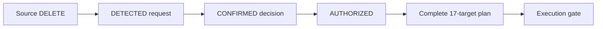

# Customer deletion: before and after

This tutorial shows every Layer3 table before and after the confirmed deletion of synthetic
customer `CUST-0099`. You will build both states, inspect the exact rows, confirm the deletion
plan, and prove the final result.

The short version is:

| Layer3 table | Before total | Before original-key rows | After total | After original-key rows | Change |
| --- | ---: | ---: | ---: | ---: | ---: |
| `dim_customer` | 17 | 1 | 16 | 0 | -1 |
| `dim_service` | 18 | 1 | 17 | 0 | -1 |
| `dim_date` | 1,461 | 0 | 1,461 | 0 | 0 |
| `fct_customer_event` | 29 | 1 | 29 | 0 | 0 |
| `fct_invoice` | 26 | 1 | 26 | 0 | 0 |

The dimensions include one permanent `ERASED_SUBJECT` member with key `-99999`. Deletion removes
the identifying customer and service members, reassigns facts to the special members, and leaves
`dim_date` unchanged.

!!! warning "Current-state deletion, not physical erasure"
    dbt replaces governed current outputs from anti-joined inputs, while incremental control
    ledgers retain the plan and suppression-admitted keys. It does not issue `DELETE FROM` against
    every relation, and this tutorial does not prove that old bytes disappeared from Delta history,
    caches, exports, object versions, or backups. Read
    [Terminal deletion versus physical erasure](../explanation/terminal-deletion-vs-erasure.md).

## Understand the example

The customer source contains two changes for one stable customer ID:

| Change | Request/change ID | Customer ID | SSN carried by the row | Time |
| --- | --- | --- | --- | --- |
| Active upsert | `CCHG-0099-U` | `CUST-0099` | `900-00-0199` | `2026-01-05 09:00:00` |
| Deletion tombstone | `CCHG-0099-D` | `CUST-0099` | `900-00-0099` | `2026-02-15 12:00:00` |

The SSNs differ. The plan expands the stable `customer_id` to both historical customer keys. Only
the key derived from `900-00-0199` has current Layer3 fixture rows, but both original identity keys
are suppressed.

The dependent source rows are:

| Source relation | Record | Important values |
| --- | --- | --- |
| Customer | `CCHG-0099-U` | `household`, active |
| Service | `SVC-0099-A` | `INTERNET`, valid `2025-04-10` through `2027-12-31` |
| Event | `EVT-0099` | `USAGE`, `9.50 GB`, occurred `2026-02-20 08:00:00` |
| Invoice | `INV-0099` | `99.00 EUR`, issued `2026-02-01`, due `2026-03-03`, unpaid |

The confirmation is separate from the customer source. It is recorded at
`2026-02-16 08:00:00`, after the tombstone.

For the exact state machine and all 17 governed targets, see
[Customer deletion control](../reference/deletion-control.md).

## Build the real before state

Use an isolated schema prefix. The `deletion_decision_as_of` variable hides decisions recorded
after its value; it does not alter the source tombstone or the persisted request.

```bash
export DBT_SCHEMA_PREFIX=deletion_walkthrough

uv run dbt seed --full-refresh \
  --vars '{deletion_decision_as_of: "2026-02-16 07:59:59"}'
uv run dbt run --full-refresh \
  --vars '{deletion_decision_as_of: "2026-02-16 07:59:59"}'
```

This is one second before the independent confirmation. The request is detected, its effective
authorization is `PENDING`, no plan exists, and the subject remains in Layer3.

See that control state directly:

```bash
uv run dbt show --inline "
select
    requests.deletion_request_id,
    requests.detection_status,
    authorizations.decision_status,
    authorizations.authorization_status,
    count(plan.target_relation) as plan_rows
from {{ ref('customer_deletion_requests') }} as requests
inner join {{ ref('customer_deletion_authorizations') }} as authorizations
    on requests.deletion_request_id = authorizations.deletion_request_id
left join {{ ref('int_customer_deletion_plan') }} as plan
    on requests.deletion_request_id = plan.deletion_request_id
where requests.deletion_request_id = 'CCHG-0099-D'
group by all
" --limit 10 --vars '{deletion_decision_as_of: "2026-02-16 07:59:59"}'
```

| `deletion_request_id` | `detection_status` | `decision_status` | `authorization_status` | `plan_rows` |
| --- | --- | --- | --- | ---: |
| `CCHG-0099-D` | `DETECTED` | `PENDING` | `PENDING` | 0 |

!!! tip
    Keep the prefix. The final build later in this tutorial changes only these isolated schemas.
    Do not use a production schema to simulate an earlier decision state.

## Count all five tables before deletion

Run one query for the complete Layer3 summary:

```bash
uv run dbt show --inline "
with subject_keys as (
    select distinct
        {{ personal_data_key('customer_ssn', 'customer.ssn', 'ssn') }} as customer_key
    from {{ ref('stg_customer') }}
    where customer_id = 'CUST-0099'
),
results as (
    select 'dim_customer' as relation_name, count(*) as total_rows,
        count(keys.customer_key) as subject_rows
    from {{ ref('dim_customer') }} as rows
    left join subject_keys as keys on rows.customer_key = keys.customer_key
    union all
    select 'dim_service', count(*), count(keys.customer_key)
    from {{ ref('dim_service') }} as rows
    left join subject_keys as keys on rows.customer_key = keys.customer_key
    union all
    select 'dim_date', count(*), cast(0 as bigint)
    from {{ ref('dim_date') }}
    union all
    select 'fct_customer_event', count(*), count(keys.customer_key)
    from {{ ref('fct_customer_event') }} as rows
    left join subject_keys as keys on rows.customer_key = keys.customer_key
    union all
    select 'fct_invoice', count(*), count(keys.customer_key)
    from {{ ref('fct_invoice') }} as rows
    left join subject_keys as keys on rows.customer_key = keys.customer_key
)
select * from results order by relation_name
" --limit 10
```

Expected result:

| `relation_name` | `total_rows` | `subject_rows` |
| --- | ---: | ---: |
| `dim_customer` | 17 | 1 |
| `dim_date` | 1,461 | 0 |
| `dim_service` | 18 | 1 |
| `fct_customer_event` | 29 | 1 |
| `fct_invoice` | 26 | 1 |

Prove that these are materialized Layer3 rows, not inferred source candidates:

```bash
uv run dbt test --select assert_layer3_deletion_walkthrough_fixture \
  --vars '{deletion_decision_as_of: "2026-02-16 07:59:59"}'
```

## Look at every table before deletion

Secret-derived pseudonymous keys differ between deployments. The placeholders below describe
their purpose without publishing or hardcoding a deployed hash.

Both customer and service dimensions already contain the `-99999` special member. It represents
no natural person or real service and has no readable mapping row. Keeping it present before facts
need it follows the dimensional-model convention that fact foreign keys should resolve to a
descriptive special member instead of becoming null.

### `dim_customer` before

There is one active customer row at grain `customer_key`:

| Column | Value for `CUST-0099` |
| --- | --- |
| `customer_key` | `<v1 key for historical SSN 900-00-0199>` |
| `customer_pk_key` | `<v1 source customer-PK key>` |
| `customer_id_key` | `<v1 key for CUST-0099>` |
| `first_name_key` | `<v1 first-name key>` |
| `last_name_key` | `<v1 last-name key>` |
| `full_name_key` | `<v1 full-name key>` |
| `email_key` | `<v1 email key>` |
| `phone_key` | `<v1 phone key>` |
| `birth_date_key` | `<v1 birth-date key>` |
| `address_key` | `<v1 address key>` |
| `customer_segment` | `household` |
| `is_active` | `true` |
| `source_updated_at` | `2026-01-05 09:00:00` |

There is no second customer row for the tombstone SSN. Its historical key is nevertheless in the
future plan so neither original identity key can survive in governed current outputs.

### `dim_service` before

There is one accepted service-version row at grain `service_version_key`:

| Column | Value for `SVC-0099-A` |
| --- | --- |
| `customer_key` | `<same historical customer key>` |
| `service_key` | `<v1 key for SVC-0099-A>` |
| `service_version_key` | `<v1 key for SVC-0099-A + 2025-04-10>` |
| `installation_address_key` | `<v1 installation-address key>` |
| `service_type` | `INTERNET` |
| `is_valid` | `true` |
| `valid_from` | `2025-04-10` |
| `valid_to` | `2027-12-31` |
| `source_updated_at` | `2026-02-01 10:00:00` |

### `dim_date` before

`dim_date` has 1,461 rows, one for each day from `2025-01-01` through `2028-12-31`. It has no
`customer_key`. For example, the event date is represented as:

| Column | Value |
| --- | --- |
| `date_key` | `20260220` |
| `date_day` | `2026-02-20` |
| `calendar_year` | `2026` |
| `calendar_quarter` | `1` |
| `month_number` | `2` |
| `month_name` | `February` |
| `day_of_month` | `20` |
| `day_of_week` | `6` |
| `day_name` | `Friday` |
| `iso_week_number` | `8` |
| `is_weekend` | `false` |

The invoice issue date `20260201` and due date `20260303` are separate rows in the same unchanged
dimension.

### `fct_customer_event` before

There is one event row at grain `event_key`:

| Column | Value |
| --- | --- |
| `event_key` | `EVT-0099` |
| `customer_key` | `<same historical customer key>` |
| `event_date_key` | `20260220` |
| `occurred_at` | `2026-02-20 08:00:00` |
| `event_type` | `USAGE` |
| `measure_value` | `9.50` |
| `measure_unit` | `GB` |
| `source_updated_at` | `2026-02-20 09:00:00` |
| `is_erased_customer` | `false` |

### `fct_invoice` before

There is one invoice row at grain `invoice_key`:

| Column | Value |
| --- | --- |
| `invoice_key` | `INV-0099` |
| `customer_key` | `<same historical customer key>` |
| `service_key` | `<v1 key for SVC-0099-A>` |
| `service_version_key` | `<matching accepted service-version key>` |
| `issue_date_key` | `20260201` |
| `due_date_key` | `20260303` |
| `paid_date_key` | `null` |
| `amount` | `99.00` |
| `currency_code` | `EUR` |
| `is_paid` | `false` |
| `source_is_due` | `false` |
| `is_due` | `false` at project `as_of_date` `2026-03-01` |
| `source_updated_at` | `2026-02-28 18:00:00` |
| `is_erased_customer` | `false` |

For the complete grain, column, and relationship contracts, see
[Layer3 and case views](../reference/layer3-and-case.md).

## Detect, confirm, and plan

Now move through the control states:



The meanings are deliberately separate:

| State | What it proves | What it does not prove |
| --- | --- | --- |
| `DETECTED` | The source tombstone was persisted | The request may delete data |
| `CONFIRMED` | An independent review approved this request | The plan is complete |
| `AUTHORIZED` | Required review metadata exists and no legal hold applies | Current outputs were rebuilt |
| Plan row | One historical key, target, and action are authorized | A physical row existed in that target |

The suppression gate fails closed. A `CONFIRMED` row with missing decision time, reviewer role,
reason, or legal-hold value becomes `INVALID`. A key reaches the gate only when its plan contains
all 17 required targets and their exact actions: deletion, erased-member reassignment, or
case-view exclusion.

## Apply the confirmed deletion

Run the same isolated project without the earlier decision cutoff:

```bash
uv run dbt run
```

The default cutoff includes the confirmation. The incremental plan now retains 34 rows:

- two historical customer keys;
- 17 governed targets per key; and
- eight Layer3 plan rows: dimensions are deleted and facts are reassigned for each key.

`dim_date` is not a deletion target because it contains no customer identity.

Check the control result:

```bash
uv run dbt show --inline "
select
    plan.deletion_request_id,
    max(authorizations.decision_status) as decision_status,
    max(authorizations.authorization_status) as authorization_status,
    count(distinct customer_key) as historical_keys,
    count(distinct concat(target_layer, '.', target_relation)) as targets,
    count(*) as plan_rows
from {{ ref('int_customer_deletion_plan') }} as plan
inner join {{ ref('customer_deletion_authorizations') }} as authorizations
    on plan.deletion_request_id = authorizations.deletion_request_id
where plan.deletion_request_id = 'CCHG-0099-D'
group by plan.deletion_request_id
" --limit 10
```

Expected result:

| `deletion_request_id` | `decision_status` | `authorization_status` | `historical_keys` | `targets` | `plan_rows` |
| --- | --- | --- | ---: | ---: | ---: |
| `CCHG-0099-D` | `CONFIRMED` | `AUTHORIZED` | 2 | 17 | 34 |

The plan and suppression-admission ledger are durable across ordinary incremental runs. Admission
is recorded before downstream models finish; it is not an atomic all-target completion event. In
this reproducible demo, an
intentional `--full-refresh` can rebuild the ledger and plan from the checked-in fixtures. A
production system needs append-only control and execution evidence outside a disposable dbt
rebuild boundary.

## Look at every table after deletion

Run the five-table query again:

```bash
uv run dbt show --inline "
with subject_keys as (
    select distinct
        {{ personal_data_key('customer_ssn', 'customer.ssn', 'ssn') }} as customer_key
    from {{ ref('stg_customer') }}
    where customer_id = 'CUST-0099'
),
results as (
    select 'dim_customer' as relation_name, count(*) as total_rows,
        count(keys.customer_key) as subject_rows
    from {{ ref('dim_customer') }} as rows
    left join subject_keys as keys on rows.customer_key = keys.customer_key
    union all
    select 'dim_service', count(*), count(keys.customer_key)
    from {{ ref('dim_service') }} as rows
    left join subject_keys as keys on rows.customer_key = keys.customer_key
    union all
    select 'dim_date', count(*), cast(0 as bigint)
    from {{ ref('dim_date') }}
    union all
    select 'fct_customer_event', count(*), count(keys.customer_key)
    from {{ ref('fct_customer_event') }} as rows
    left join subject_keys as keys on rows.customer_key = keys.customer_key
    union all
    select 'fct_invoice', count(*), count(keys.customer_key)
    from {{ ref('fct_invoice') }} as rows
    left join subject_keys as keys on rows.customer_key = keys.customer_key
)
select * from results order by relation_name
" --limit 10
```

| `relation_name` | `total_rows` | `subject_rows` |
| --- | ---: | ---: |
| `dim_customer` | 16 | 0 |
| `dim_date` | 1,461 | 0 |
| `dim_service` | 17 | 0 |
| `fct_customer_event` | 29 | 0 |
| `fct_invoice` | 26 | 0 |

Here is what changed, table by table:

| Table | After deletion |
| --- | --- |
| `dim_customer` | No row matches either historical key; the `-99999` erased member remains. Total: 17 to 16. |
| `dim_service` | `SVC-0099-A` is absent; the `-99999` erased service remains. Total: 18 to 17. |
| `dim_date` | All 1,461 calendar rows remain, including `20260201`, `20260220`, and `20260303`. |
| `fct_customer_event` | `EVT-0099` remains with `customer_key = -99999` and `is_erased_customer = true`. Total stays 29. |
| `fct_invoice` | `INV-0099` remains with all customer/service keys `-99999` and `is_erased_customer = true`. Total stays 26. |

The four protected tables do not contain readable SSNs, names, or email addresses. The original
secret-derived historical keys disappear and retained facts share one non-person sentinel. Their
source transaction IDs remain, however, and can be deterministically re-linked through the
restricted source history retained by this demo.

The retained fact rows now look like this:

=== "Event after"

    | Column | Value |
    | --- | --- |
    | `event_key` | `EVT-0099` |
    | `customer_key` | `-99999` |
    | `event_date_key` | `20260220` |
    | `occurred_at` | `2026-02-20 08:00:00` |
    | `event_type` | `USAGE` |
    | `measure_value` | `9.50` |
    | `measure_unit` | `GB` |
    | `is_erased_customer` | `true` |

=== "Invoice after"

    | Column | Value |
    | --- | --- |
    | `invoice_key` | `INV-0099` |
    | `customer_key` | `-99999` |
    | `service_key` | `-99999` |
    | `service_version_key` | `-99999` |
    | `issue_date_key` | `20260201` |
    | `due_date_key` | `20260303` |
    | `paid_date_key` | `null` |
    | `amount` | `99.00` |
    | `currency_code` | `EUR` |
    | `is_paid` | `false` |
    | `is_erased_customer` | `true` |

!!! danger "A dummy key is not automatic GDPR anonymisation"
    Exact timestamps, unusual measures, invoice amounts, and retained transaction IDs can still
    permit singling out or linkage. Production retention needs a documented purpose and legal
    basis or exception, a re-identification risk assessment, and further generalisation or
    aggregation where required. Pseudonymised data remains Personal Data. The EDPB's July 2026
    version-one anonymisation guidance assesses record isolation, linkage, and inference and is
    currently under [public consultation](https://www.edpb.europa.eu/public-consultations/guidelines-022026-on-anonymisation_en).

## What happens to the case views?

The four `layer3_case` views exclude special members and erased facts explicitly. For an authorized
case or privacy identity, `CUST-0099`, `SVC-0099-A`, `EVT-0099`, and `INV-0099` are all absent even
though the two protected fact rows remain for aggregate analysis.

An unaffiliated identity sees zero rows both before and after because the views fail closed. That is
access denial, not deletion evidence. Follow
[Verify terminal deletion](../how-to-guides/verify-terminal-deletion.md) for the separate authorized
case-view aggregate check.

## Prove the walkthrough contract

Run the focused executable checks:

```bash
uv run dbt test --select assert_layer3_deletion_walkthrough_fixture
uv run dbt test --select tag:deletion_control
```

The walkthrough fixture test protects all documented numbers. It verifies one valid upstream
customer, service, event, and invoice; two historical keys; eight Layer3 plan rows with exact
actions; the exact final totals; zero original subject keys; and one reassigned event and invoice.

You have now proved that:

- the source deletion was detected and stored;
- a separate, complete confirmation authorized it;
- the complete plan existed before the suppression gate opened;
- dimensions removed the subject while facts retained their grain under `-99999`;
- `dim_date` remained unchanged;
- control evidence remained deliberately retained; and
- no unsupported physical-erasure claim was made.

That is the complete Layer3 before-and-after path.

Clear the walkthrough prefix before returning to ordinary dbt work:

```bash
unset DBT_SCHEMA_PREFIX
```

This stops later commands from silently targeting the walkthrough schemas. It does not drop them;
schema retention and cleanup remain an operator decision.
